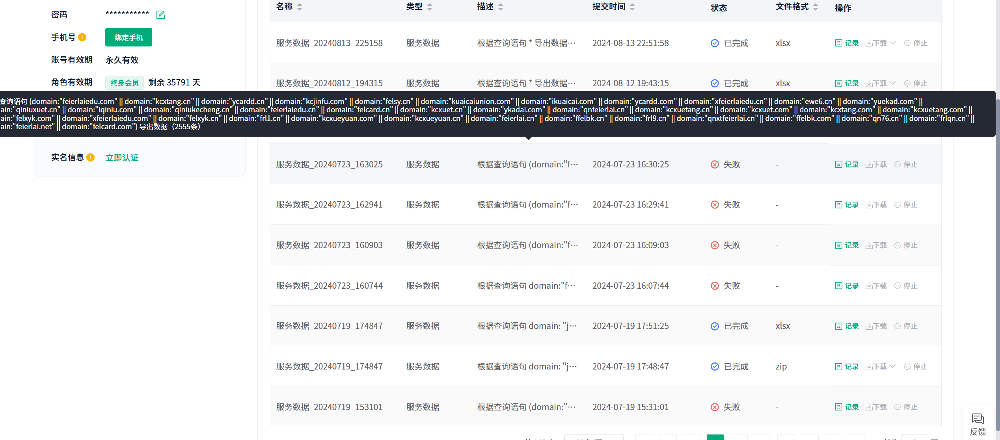
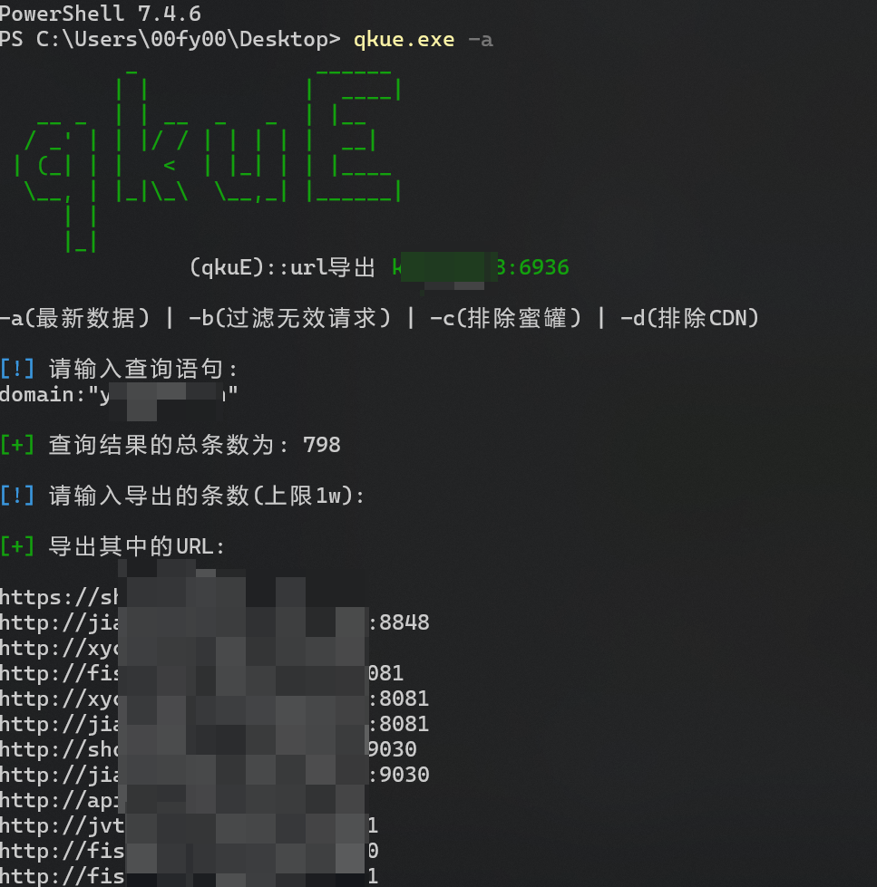

# qkue

quake资产导出工具,为了解决quake的两个小问题而出生的工具:

quake搜索的时候太多的 or 语句会导致导出失败.
quake自带的导出去重功能,会去重掉一些不重复的网址


工具优点:
好看,简约,导出就是url可直接联动httpx

## 编译

要使用代理

```
go mod init qkue
go mod tidy
go build .
```

## 使用

填写quake的api到quake.yaml中,然后运行程序.



导出的url在当前目录下的 url_export.txt 中

## 其他

如有问题请发lssues

给个star呗❤